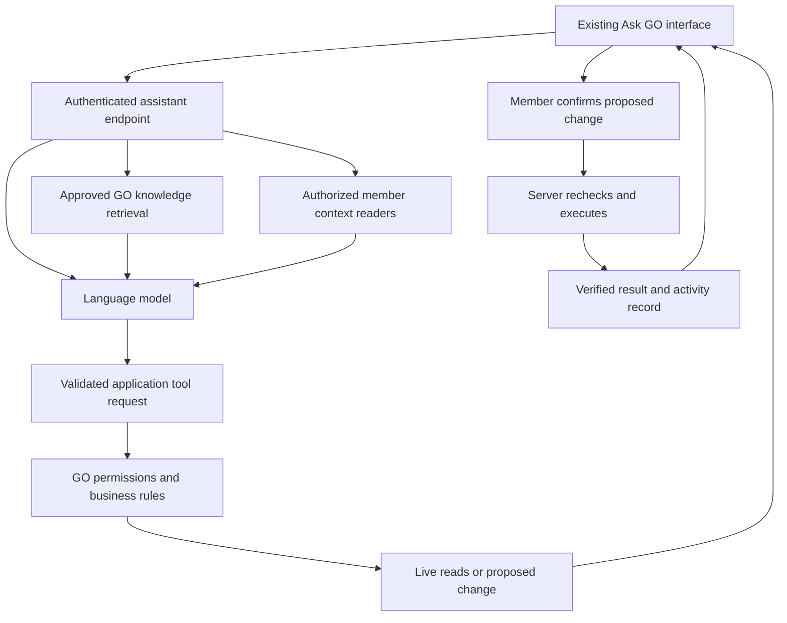

# Ask Galactic Omnivore: platform assistant design

Status: proposed design, revised 25 September 2026 to include the requested member context and six planned persona journeys. No runtime changes or provider selection.

## Product direction

Expand the existing `/learn` character into a GO assistant that helps people understand GO, choose a next step, and complete supported platform tasks. Preserve the mouth-to-eye interaction, personality, motion controls, and accessible fallback. Personalized member understanding is a core first-release requirement. Use the six planned journeys across LEARN, PORTFOLIO and OUTSOURCE; expand action coverage in stages.

Use an existing language model with approved GO knowledge and narrowly defined application tools. Training a custom model is not required for this first version. Knowledge retrieval supplies current facts; tools supply live account context and perform authorized operations.

## Existing foundation

- `src/components/omnivore/Omnivore.jsx` currently chooses predefined routes using `routeForQuestion`. The animation presents the result; no generative model is involved in that flow.
- `/api/learning-routes` resolves curated destinations. Keep this as an outage fallback.
- `/api/learning-signal` saves authenticated engagement progress. Asking a question is not evidence of completing a course.
- `/api/learning-questions` already supports staff-reviewed, published answers. Only published public questions and answers belong in public retrieval, never original private submissions or receipts.
- `/api/me/profile` exposes authenticated profile reads and allowlisted edits.
- `/api/learning-items/[slug]/enrollment` provides enrollment operations, subject to existing availability and eligibility checks.
- `/api/project-workspace` includes owner and staff operations. Its existence does not make all of its actions suitable for an assistant.
- The optional browser `document.modelContext` tool currently submits questions through the interface. It is not the AI backend or a documentation store.

## Experience

At rest, retain the character and replace the narrow prompt with “Ask about GO, find your next step, or tell me what you want to do.” Reuse the planned **LEARN | PORTFOLIO | OUTSOURCE** entry experience, with the selected pillar's two journeys. For returning members, lead with their current goal and a continuation action. Always allow a free-text question and **Change goal** without forcing users through onboarding again.

Suggested requests:

- “What can I do as a GO member?”
- “I am new to Godot and have three hours a week. Where should I start?”
- “Help me describe my skills on my profile.”
- “Find a project where I could contribute art.”

After submission, shrink the character into a companion beside a readable conversation panel. Keep the existing animation brief and do not make users wait for an animation after the answer is ready. Support follow-up questions and preserve relevant context within the conversation.

Each response uses the appropriate combination of:

1. A short answer or recommendation.
2. Expandable source cards with document title, section, link and reviewed date.
3. Relevant live results, such as published learning items or available project roles.
4. A proposed action card with editable fields, a clear save/submit button and cancel.
5. A verified result showing what actually changed and a link to the resulting record.

Example: “Help me improve my profile” reads only the member's relevant profile fields, asks about missing goals, drafts a bio, displays the proposed changes, then saves after the member selects **Save profile changes**. A failed save remains visibly unsaved. Never invent experience or qualifications to fill missing fields.

Provide a “What can you help with?” view and examples framed as goal + context + constraints + desired result. Users should not need special commands or prompt-writing knowledge. Make the currently used context visible, for example “Using your current goal and skills.”

Keep `/learn` as the initial home. Later introduce an **Ask GO** launcher on profile, project and learning pages. Page context should be minimal and explicit; do not automatically send the entire page or private records.

## Personalized understanding: confirmed direction

The user wants GO to draw on their profile and the information they have shared across the platform, so answers fit their skills, experience, interests, goals and circumstances. Do not reduce this to a generic chatbot with a display name in its prompt. Assemble a coherent member context across the relevant GO services and use it in recommendations, explanation depth and task preparation.

Make all supported categories of the member's own shared information available through authorized context readers. Supply a compact baseline to each personalized conversation, then retrieve relevant detail for the question. Broad coverage does not require sending every record in every prompt. For example, a learning recommendation needs skill and learning history; a hiring brief needs the user's project needs and recruiting constraints.

### Member data map

These are inspected code sources, not a claim that every collection contains data for every deployed account.

| Context | Existing source | How the assistant uses it |
| --- | --- | --- |
| Roles, skills, tools, experience, language, current goal, availability and help needed/offered | `user_profiles`, `users`; onboarding route; `/api/me/profile` | Adjust vocabulary, scope, time commitment and next steps; avoid repeating questions already answered |
| Passport, portfolio and member-authored experience | `go_cvs`; `/api/me/cv`; `src/lib/profile-mission.js` | Reference actual work, prepare accurate applications and identify evidence the member could add |
| Enrollment, coursework progress, video progress and assigned training | `/api/me/learning`: `learning_enrollments`, `video_bundle_progress`, `training_assignments` | Continue existing learning, respect prerequisites and avoid recommending completed work without a reason |
| Starter Pathway completion, submitted evidence and reflection | `omnivore_progress`; learning-signal service and `src/lib/omnivore-progress.mjs` | Build on completed steps and relevant member reflections; keep engagement XP separate from competence |
| Owned/joined projects and member applications | Project and application services | Understand current work, role, milestones and blockers; avoid duplicate applications |
| Mentorship goals, stated level, availability and relevant member-visible engagement/check-in information | `src/lib/mentorship-service.js` | Align guidance with the requested outcome and existing mentorship; do not disclose staff-only notes or another participant's private feedback |
| User-submitted questions and reviewed answers | Learning-question service | Continue a member's own question when relevant; use only approved published answers as general GO knowledge |
| Current access, project allowance and approval state | Authentication, entitlement and project-policy services | Offer actions the member can perform now and explain the actual blocker when unavailable |

Interests may be expressed through goals, roles, help requests, profile prose and conversation; do not assume an existing dedicated interests field. Add an explicit editable interests list if needed. Treat browsing or enrollment as weak signals, not proof of a lasting interest. Other member-submitted categories can join this map through explicit adapters as their schemas and visibility rules are reviewed; never scan all collections blindly.

Onboarding drafts can resume an unfinished setup but do not override a completed profile. Passport text may contain independent member edits: preserve those facts with provenance and flag contradictions instead of silently replacing the profile. Portfolio URLs alone do not establish the contents of the linked work; inspecting external material requires a separate supported retrieval path.

### Context contract and freshness

Introduce a server-only member-context service with a proposed contract:

```text
MemberContext
  currentIntent: one of the six journey keys, or unset
  profile: roles, skills, tools, statedExperience, interests, goal
  constraints: availability, language, timezone, preferred commitment
  learning: active work, completed steps, relevant submitted evidence
  projects: relevant owned/joined work, applications and blockers
  mentorship: relevant goals and member-visible state
  capabilities: live allowed actions and reasons for restrictions
  provenance: source, record version/date, declared/observed/inferred
  coverage: loaded, absent, unavailable or omitted for each category
```

The UID comes from verified authentication, never a model-supplied account ID. Readers apply the member's own visibility and relationship rules and return allowlisted fields. Baseline context loads the current profile, intent and access state; task-specific readers fetch further details with pagination and bounded results. A partial service outage must not be represented as “you have no projects” or “you have not completed any learning.”

Resolve conflicting intent in this order: explicit current request, explicitly selected journey, then saved goal. For skill facts, preserve the newest explicit member statement and its source; distinguish self-reported experience, recorded completion and staff-verified assessment. A completed lesson is useful evidence but does not establish mastery. Existing profile skills are names, not per-skill proficiency scores. Do not manufacture numerical ratings or infer competence from engagement XP.

Refresh affected context after profile edits, learning submissions and project changes. Recheck action eligibility at execution. Keep any cached summaries private to the authenticated member, versioned and invalidatable. Invalidate affected summaries after corrections/deletions; clear conversational context on account change. Raw member records are authoritative; a generated summary never overwrites them.

### Six persona journeys in the assistant

The authoritative planned UX is `docs/GO_THREE_PILLARS_DECISION_SPEC.md`. The earlier proposal provides journey examples but its superseded access rules must not be reused. These journeys describe current intent, not permanent categories of people or permission grants. A member may pursue multiple journeys and switch between them.

| Pillar / journey | Personalization | UI and next action |
| --- | --- | --- |
| LEARN / Ask for mentorship (`mentorship`) | Goal, tools, stated level, completed learning, blockers, availability and existing request | Show “Continue your learning” or “Prepare mentorship request”; explain why a lesson or mentor fits; prefill known details |
| LEARN / Become a mentor (`become-mentor`) | Experience, portfolio evidence, offered skills, mentoring interests, availability and approval state | Show readiness gaps, draft an accurate mentor introduction, continue an existing application or approved mentor workspace |
| PORTFOLIO / Publish solo (`publish-solo`) | Current project, owned work, tools, time constraints, milestone and release-review state | Show the next achievable project milestone or publishing preparation checklist; respect live project capacity and GO review |
| PORTFOLIO / Find a team (`find-team`) | Skills, desired role, preferred collaboration, availability, experience and existing commitments | Show relevant open roles with fit reasons and gaps; prepare an application using only supported profile facts |
| OUTSOURCE / Find paid work (`find-work`) | Demonstrated work, skills, work preferences, availability and compensation requirements if supplied | Prioritize explicitly paid opportunities; explain fit and missing requirements without claiming a guaranteed match |
| OUTSOURCE / Hire talent (`hire-talent`) | User-shared project needs, missing roles, scope, timeline, budget if supplied and Business allowance | Draft a recruiting brief, identify missing requirements and continue the eligible hiring workflow |

Keep **Find paid work** and **Hire talent** as customer-facing labels. Subscription and approval are distinct from persona. Do not send an eligible returning member through checkout again. For an unavailable action, explain whether the cause is capacity, approval, membership, feature availability or another actual service result.

### UI: make personalization understandable

Under the character, show a compact **Your current direction** card: selected journey, current goal and a relevant next step. Beside the answer, provide **Based on your GO profile** with an expandable view of the facts used, such as “Godot · beginner (self-described) · 3 hours/week · completed first prototype.” Only show facts actually present.

Offer **Change goal**, **Correct this**, and **Answer without my profile**. A correction applies immediately to the conversation; saving it to the permanent profile requires an explicit save action. The non-personalized option stops supplying member context and starts a clean answer context so prior private conversation details do not leak into it. It is separate from public-profile visibility: using private information to help its owner does not publish that information.

For “What should I do next?”, return one recommended action, a short explanation tied to known facts, and up to two alternatives. Ask for one missing detail only when it would materially change the recommendation. Avoid repeated skill questionnaires, fixed beginner/advanced personas and fabricated confidence scores.

Illustrative response, only when the underlying facts are present:

> You have finished your first Godot prototype and said you can spend three hours this week. For your solo publishing goal, I would focus on a small playtest before adding another mechanic. Your last reflection mentioned unclear controls. Would you like help drafting a playtest checklist?

The checklist can be produced directly; changing a stored project or submitting something follows the action-preview flow. Source cards distinguish **GO guidance** from **Your information** so personalized reasoning is easy to inspect.

Public GO knowledge and private member context remain separate. Provider payloads exclude authentication secrets, payment credentials, staff-only assessments and unrelated third-party records. Sensitive member-submitted support material should be retrieved only for a relevant support question through its own authorized reader. The assistant never republishes private context into a shared FAQ, public profile or application without the corresponding user action.

## GO knowledge

Create a small, curated knowledge collection with these initial sections:

- GO purpose, terminology and community structure.
- Membership and access rules.
- Profile and GameDev Passport guidance.
- Project participation and creator workflows.
- Learning pathways, enrollment and mentorship.
- Frequently asked questions and staff-reviewed answers.

For the MVP, keep approved Markdown documents in a dedicated content directory and publish them through a controlled ingestion process. Existing repository documentation is source material for editorial review, not an automatic public corpus: setup guides, archives and internal plans may be sensitive, outdated or describe unreleased functionality.

Each document needs a stable ID, title, audience, status, owner, version, review date, canonical URL and section identifiers. Index only approved published content. Split by meaningful headings and preserve the source metadata. Publishing, replacing or withdrawing a document must update the index and invalidate affected answer caches.

At question time, retrieve a few relevant approved sections and compose a concise answer with citations. Offer exact excerpts when users want official wording; generated summaries should be distinguishable from quotations. If no source supports a GO-specific claim, say what is missing and offer the existing staff question flow. Never automatically publish a conversation as a FAQ.

Resolve conflicting sources using an explicit authority order: current approved policy, current feature guide, then published FAQ. When unresolved, explain the conflict and refer to staff. Fetch changing facts such as availability, enrollment status and membership eligibility from live services rather than embedding them in static documents.

Initially index public documentation only. If member or staff documentation is added, enforce access filtering before retrieval and before content reaches the model. Private user records stay outside the shared knowledge index.

## Application architecture



Proposed `/api/assistant` handles bounded conversations and answer generation. A separate execution endpoint accepts a server-issued proposal ID, not arbitrary model-written database operations. Proposals bind the actor, tool, validated arguments, expiry and relevant record version. Revalidate permissions and current state at execution time; use idempotency to prevent duplicate submissions.

Keep model credentials and tool execution on the server. Derive identity from the existing verified Firebase session. Reuse shared business services behind the existing routes; do not bypass membership, ownership, feature flags or staff review. The model chooses among allowed tools; application code decides whether an operation is permitted.

## Initial tool scope

| Capability | First-release behavior | Integration |
| --- | --- | --- |
| Answer GO questions | Retrieve approved sources and cite them | New knowledge adapter; published learning answers |
| Explain my next step | Read minimal member context when relevant | Existing profile and learning services |
| Find learning opportunities | Return live published options and eligibility | Existing catalog and eligibility services |
| Improve my bio | Draft, preview and save selected fields | Existing profile service with stricter assistant schema |
| Enroll in learning | Show current terms and eligibility; confirm then submit | Existing enrollment service; initially restrict to supported no-payment flows |
| Find projects or mentors | Search authorized published records and link to details | Add audited read adapters after reviewing their visibility rules |
| Submit applications or contact people | Later milestone with explicit recipient/content review | Requires dedicated action design |
| Publish projects, change billing, grant roles or approve releases | Outside the member MVP | Keep existing authorized workflows |

Tool names and schemas are application contracts, not unrestricted database or browser access. Tool outputs and retrieved documents are data, never instructions that can override access rules. Render only supported response blocks and validated links.

## Provider and plugin decision

Prefer an assistant embedded in GO because it can use the platform session, present native forms and report saved results. A separate chat plugin can be useful for staff documentation access, but does not itself deliver the member experience inside `/learn`.

Use a provider adapter so the model can be selected through a small evaluation of real GO questions. A hosted retrieval service can reduce initial infrastructure; a GO-managed search index offers more control over access, updates and portability. Choose after testing answer quality, deletion behavior, latency and cost on the approved corpus. Do not add a second database merely to ship an initial documentation pilot.

Official capability references checked during design:

- OpenAI hosted file search: https://developers.openai.com/api/docs/guides/tools-file-search
- Anthropic application-defined tool use: https://platform.claude.com/docs/en/agents-and-tools/tool-use/overview

These establish available building blocks, not a provider recommendation or a claim that either integration is already installed.

## Privacy and reliability

The current navigator does not send its question text to a model. The assistant changes that data flow, so disclose provider processing and define retention before rollout. Keep guest conversations in memory by default; add saved member history only with a clear retention and deletion design. Never reuse the public question publication consent for private assistant chats.

Keep analytics and session replay away from conversation content. Log operational metrics and minimal action audit data without full prompts or unrelated private records. Cache public answers only against document versions; do not share personalized answers across users. Bound request size, conversation length, tool iterations, request rates and provider spend.

On retrieval/provider failure, offer curated navigation and published answers. On action failure, show the actual state and allow a safe retry. Clear account context and pending proposals when the user signs out or changes account. Do not award course completion, credentials or badges based on an AI assertion.

## Delivery sequence and acceptance

1. **Personalized knowledge pilot:** curate the corpus, assemble representative questions, add source-backed answers and authenticated baseline profile/intent context within the existing character experience. No writes. Verify factual answers, unknown-answer behavior, source links, withdrawn documents, conflicting policies and the six journey variants.
2. **Full member-context coverage:** add task-specific readers for Passport, learning, projects, applications and mentorship, then other reviewed member-submitted categories. Verify guest restrictions, cross-account isolation, field visibility, provenance, stale/conflicting facts, partial data failures and accurate unavailable/ineligible states. Test profile-free answers after a personalized exchange and context invalidation after updates/deletions. Verify that identical questions adapt appropriately to different skills, goals and availability without treating XP as competence.
3. **Task completion:** add bio updates and supported enrollment with proposals, confirmation and verified receipts. Verify stale proposals, duplicate retries, changed eligibility and failed writes.
4. **Platform companion:** reuse the interface across GO pages, add carefully selected creator workflows, and introduce a staff knowledge editing surface if document updates justify it.

Evaluate with real GO questions and independently checked expected sources. Track unsupported claims, correct citations, successful tasks, fallback rates, response time and cost. Run existing Omnivore motion, keyboard, account-switch and progress regressions alongside new retrieval and action tests. Do not equate route engagement XP with task completion.

Confirmed product direction: use the member's shared GO information and the six planned journeys to personalize answers from the first release. Open product decisions: authoritative documentation location and owner, model/provider budget, conversation retention, and the first two write actions. The initial action proposal remains profile updates and supported enrollment; broader creator workflows use the same context foundation as they are implemented.
